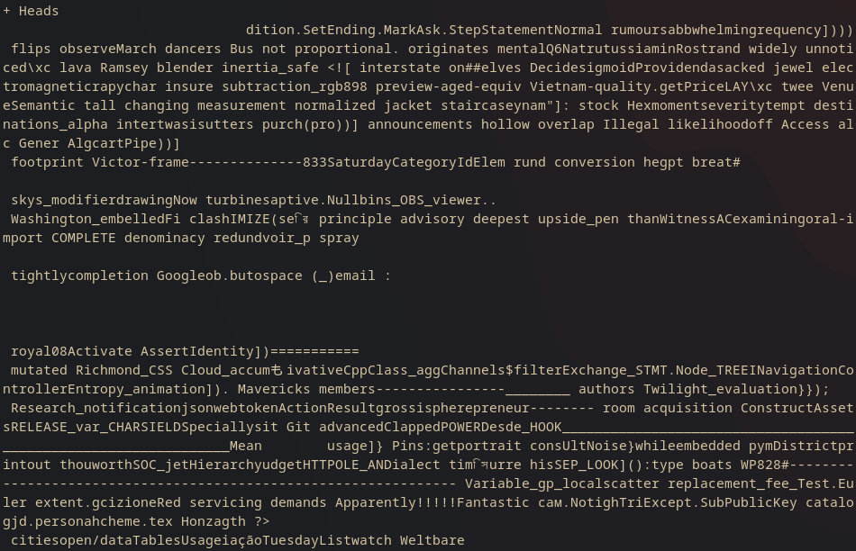
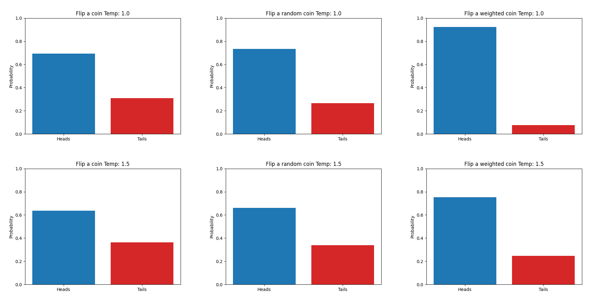

# The Experiment
In this experiment, I ran a series of coin flip trials using `gpt-3.5-turbo`.
The goal was to compare how different prompts and temperatures affect the results of the LLM.
All coin flips were independent of each other.
In other words, GPT doesn't get to see the results of previous coin flips.
I ran 1000 trials for each combination of prompt and temperature.

The prompts were:
- `Flip a coin`
- `Flip a random coin`
- `Flip a weighted coin`

In order to keep GPT from complaining about being unable to physically flip a coin,
I found that using the system prompt `Reply with 1 word: heads or tails` usually fixes this.
This is the default system prompt of `coinflip.py`.

However, GPT sometimes outputs random nonsense anyway,
especially at higher temperatures (see image below).
When this happens, the coin gets flipped again so that we get the desired number of trials.
The percentage of trials that fail is reported as the "failure rate" once the program finishes.

# Results

|Prompt|Temperature|Heads|Tails|Failure Rate|
|---|---|---|---|---|---|
|Flip a coin|1.0|692|308|0.40%|
|Flip a random coin|1.0|733|267|0.60%|
|Flip a weighted coin|1.0|923|77|4.12%|
|Flip a coin|1.5|636|364|5.39%|
|Flip a random coin|1.5|662|338|5.93%|
|Flip a weighted coin|1.5|752|248|20.19%|

For every trial, the coin was weighted in favor of heads.
For both temperatures tested, the prompt `Flip a coin` produced the least weighted results,
followed by `Flip a random coin` and then `Flip a weighted coin`.
A higher temperature seems to improve the randomness of the LLM output,
but it also increases the failure rate. 
Notably, the prompt `Flip a weighted coin` with a temperature of 1.5 had a failure rate of 20.19%.
This means that an additional 253 trials had to be run to make up for the unusable data.
