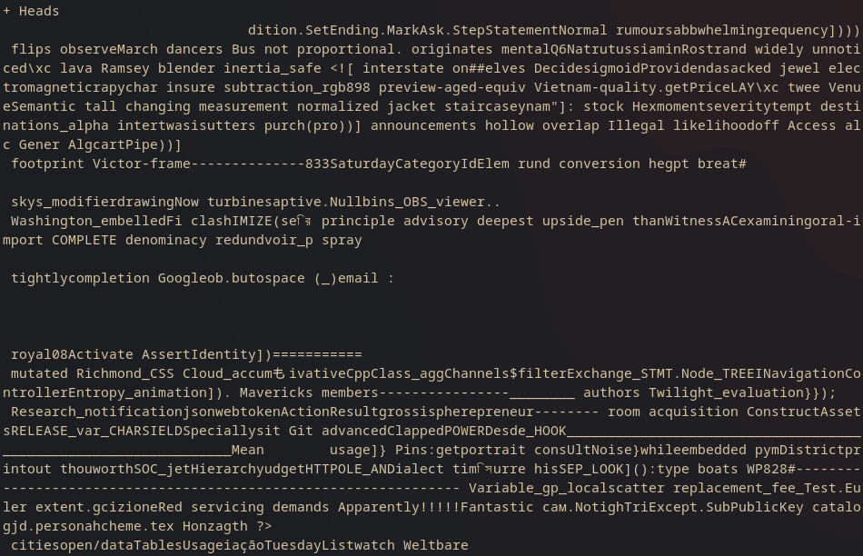

# The Experiment
In this experiment, I ran a series of trials to compare how different prompts and LLM temperatures affect the coin flips produced by `gpt-3.5-turbo`.
All coin flips were independent of each other. In other words, GPT doesn't get to see the previous coin flip results.
I ran 1000 trials for each combination of prompt and temperature.

The prompts were:
- `Flip a coin`
- `Flip a random coin`
- `Flip a weighted coin`

The `statistics.py` program is built around `coinflip.py`.
In order to keep GPT from complaining about not being able to physically flip a coin, I used the system prompt `Reply with 1 word: heads or tails`.

Sometimes, however, GPT still outputs some random nonsense that has nothing to do with coin flipping, especially at higher temperatures.

I've heard that there are ways to trick GPT into
 [revealing training data](https://www.businessinsider.com/google-researchers-openai-chatgpt-to-reveal-its-training-data-study-2023-12),
 so perhaps this is something similar.
 Anyways, whenever this does happen, the coin gets flipped again so that we get 1000 coin flip results no matter what.
 The percentage of trials that fail is shown as the "failure rate" once the program finishes.
